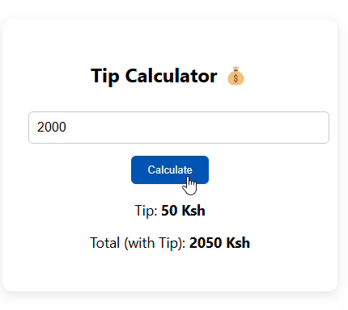

[](https://tip-calculatorr-jade.vercel.app/)
---
# 🚀 **Tip Calculator**  
> _A place were a place can calculate tip depening on the purchase of the client_
---

## 🔥 **Features**
✅ Insanely cool functionality  
✅ Aesthetic UI with sleek animations 🎨  
✅ Optimized for speed ⚡  
✅ 100% bug-free* (*hopefully 🤞)  

---

## 📦 **Installation**
```bash
# Clone the repo
 git clone https://github.com/patel-vansh1607/tip-calculator

# Navigate into the project
 cd tip-calculator

# Install dependencies
 npm install

# Run the app
 npm start
```

---

## 🎮 **Usage**
1. Open the app 🚀
2. Click buttons 🔘
3. Witness magic 🪄

---

## 📸 **Screenshots**


---


## 🤝 **Contributing**
We welcome PRs! 🎉 
1. Fork it 🍴
2. Create a new branch 🌱
3. Make changes ✍️
4. Submit PR 🚀

---

## 🌟 **Show Your Support**
If you love this project, ⭐ the repo and spread the word! 💖  

---

> Made with 🤯, 🔥, and way too much ☕